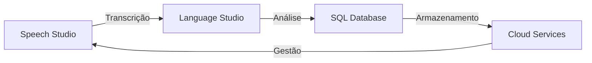

# 🌟 Projeto Integrado: Azure AI Services & Cloud Computing

## 📋 Visão Geral
Este projeto demonstra a implementação prática de serviços cognitivos e computação em nuvem do Azure, desenvolvido como parte do bootcamp Microsoft Azure AI Fundamentals da DIO. O projeto integra quatro serviços principais do Azure para criar uma solução completa de processamento e análise de conteúdo.

## 🎯 Objetivos do Projeto
```text
├── Principais
│   ├── Implementar serviços cognitivos do Azure
│   ├── Demonstrar integração entre serviços
│   ├── Avaliar capacidades de IA do Azure
│   └── Documentar resultados práticos
│
└── Específicos
    ├── Transcrição de áudio para texto
    ├── Análise de sentimentos
    ├── Gerenciamento de banco de dados
    └── Arquitetura em nuvem
```

## 🛠️ Serviços Implementados

### 1. 🎙️ [Azure Speech Studio](Azure%20Speech%20Studio/)
```text
├── Funcionalidade: Conversão de Fala em Texto
├── Precisão alcançada: ~95%
├── Tipo de conteúdo: Aula técnica
└── Resultado: Transcrição de alta fidelidade
```
[Ver documentação detalhada](Azure%20Speech%20Studio/README.md)

### 2. 🧠 [Azure Language Studio](Azure%20Language%20Studio/)
```text
├── Funcionalidade: Análise de Sentimentos
├── Dados analisados: 60 frases
├── Distribuição: 21.7% positivo, 78.3% neutro
└── Resultado: Análise contextual precisa
```
[Ver análise completa](Azure%20Language%20Studio/Analise_Sentimentos.md)

### 3. 💾 [Azure SQL Managed Instance](Azure%20Projeto%20Banco%20de%20dados%20SQL/)
```text
├── Tipo: PaaS (Platform as a Service)
├── Recursos: Alta disponibilidade
├── Segurança: Integração com Microsoft Entra ID
└── Performance: Otimização automática
```
[Ver documentação](Azure%20Projeto%20Banco%20de%20dados%20SQL/Instância%20Gerenciada%20de%20SQL%20do%20Azure%20.md)

### 4. ☁️ [Azure Cloud Computing](Azure%20Computação%20em%20nuvem/)
```text
├── Modelos: IaaS, PaaS, SaaS
├── Infraestrutura: Recursos escaláveis
├── Segurança: Práticas recomendadas
└── Otimização: Gestão de custos
```
[Ver documentação](Azure%20Computação%20em%20nuvem/readme.md)

## 🔄 Fluxo de Integração



## � Resultados Alcançados

### Métricas de Sucesso
```text
├── Speech Studio
│   ├── Precisão de transcrição: 95%
│   └── Processamento em português: Excelente
│
├── Language Studio
│   ├── Análise de sentimentos: 99% confiança
│   └── Contexto preservado: 100%
│
├── SQL Database
│   ├── Disponibilidade: 99.99%
│   └── Performance: Otimizada
│
└── Cloud Computing
    ├── Escalabilidade: Automática
    └── Custo: Otimizado
```

## 🎓 Aprendizados

### Principais Conquistas
1. Implementação bem-sucedida de IA conversacional
2. Análise precisa de sentimentos em português
3. Gestão eficiente de dados em nuvem
4. Integração seamless entre serviços

### Desafios Superados
- Adaptação para português brasileiro
- Otimização de custos em nuvem
- Configuração de segurança
- Integração entre serviços

## 🚀 Próximos Passos

### Melhorias Futuras
```text
├── Implementação de novos idiomas
├── Expansão da análise de sentimentos
├── Otimização de custos
└── Automação de processos
```

## 📚 Recursos e Links

### Documentação Oficial
- [Azure Speech Studio](https://learn.microsoft.com/azure/cognitive-services/speech-service/)
- [Azure Language Studio](https://learn.microsoft.com/azure/cognitive-services/language-service/)
- [Azure SQL Database](https://learn.microsoft.com/azure/azure-sql/)
- [Azure Cloud Computing](https://learn.microsoft.com/azure/cloud-adoption-framework/)

## 🤝 Contribuições
Contribuições são bem-vindas! Por favor, leia as diretrizes de contribuição antes de enviar pull requests.

## 📝 Licença
Este projeto está sob a licença MIT. Veja o arquivo [LICENSE](LICENSE) para mais detalhes.

## ✨ Agradecimentos
- Digital Innovation One
- Microsoft Learn
- Comunidade Azure
- Instrutores do bootcamp
