Validador de Bandeira de Cartão (Desafio Copilot)


Validador de Bandeira de Cartão (Desafio Copilot)
===============================================

Este projeto contém um script simples para identificar a bandeira de um
cartão de crédito a partir do seu número (Visa, MasterCard, American Express,
Discover, etc.) e verificar o dígito verificador usando o algoritmo de Luhn.

O objetivo era refatorar e melhorar um protótipo inicial com foco em legibilidade,
uso prático e validação básica.

Repositório contém:

- `identificador_bandeira_cartao.py`: script principal com funções reutilizáveis
	e interface de linha de comando (aceita múltiplos números ou modo interativo).

Como usar
---------

Requisitos:

- Python 3.8+

Exemplos de execução:

1) Passar números como argumentos:

```powershell
python "Projeto Validador de Cartao pelo Github Copilot\identificador_bandeira_cartao.py" 4111111111111111 378282246310005
```

2) Executar sem argumentos para modo interativo (prompt):

```powershell
python "Projeto Validador de Cartao pelo Github Copilot\identificador_bandeira_cartao.py"
```

Cartões de teste (exemplos comuns):

- Visa: 4111111111111111
- MasterCard: 5555555555554444
- American Express: 378282246310005
- Discover: 6011111111111117

Notas
-----

- Este projeto é uma ferramenta didática para identificar padrões de BIN
	e exemplificar a verificação Luhn. Não deve ser usada como mecanismo
	de segurança em produção.

Contribuições
-------------

Pull requests e melhorias são bem-vindas. Sugestões úteis:

- adicionar testes automáticos (pytest)
- integrar uma lista completa de BINs atualizada
- adicionar logging e tratamento de erros mais completo

Licença
-------

Sinta-se livre para usar este código para aprendizado e demos.

CI / Status
-----------


Demo / Vídeo de apresentação
----------------------------

Insira aqui o link ou GIF do vídeo de apresentação (30–60s) que demonstra o uso do
script. Recomenda-se um GIF curto no topo do README e um link para um vídeo hospedado
no YouTube ou onde preferir.

Exemplo (substitua pelo seu link):



Vídeo: https://youtu.be/SEU_VIDEO_AQUI
